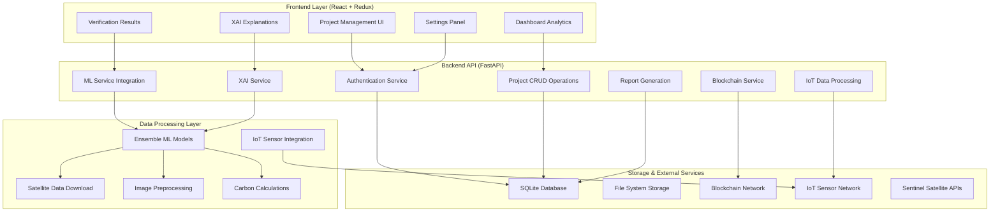
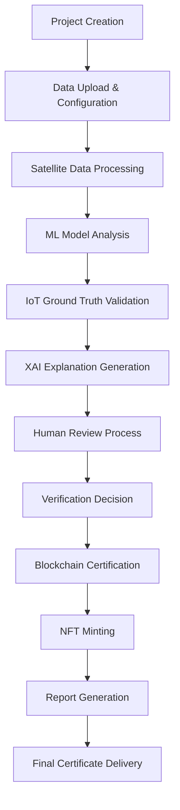
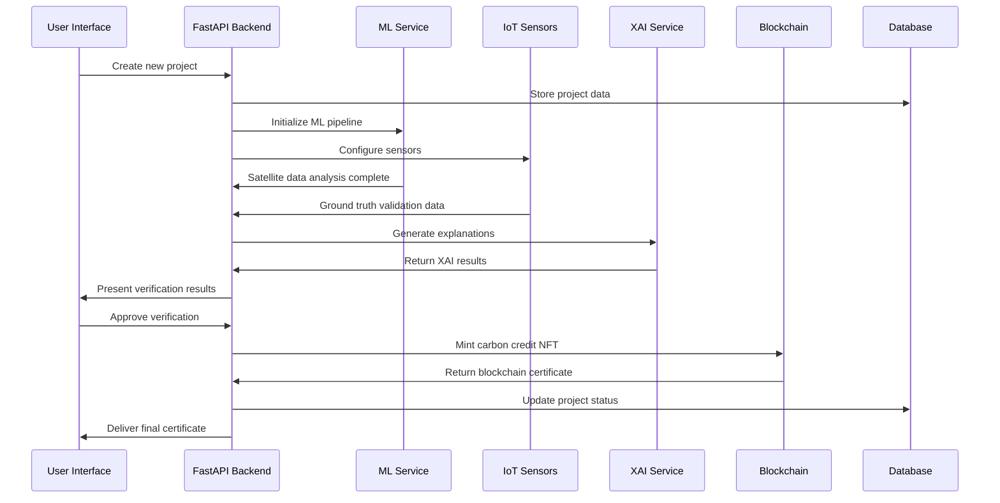

# Comprehensive Carbon Credit Verification System - Complete Feature Integration Guide

## Executive Summary

This document provides an in-depth understanding of the complete Carbon Credit Verification SaaS platform, detailing the end-to-end workflow from project creation to final certification. The system integrates satellite imagery analysis, machine learning models, IoT sensor networks, blockchain technology, explainable AI (XAI), and comprehensive reporting to create a transparent, automated, and scientifically rigorous carbon credit verification process.

---

## Table of Contents

1. [System Architecture Overview](#1-system-architecture-overview)
2. [Complete Verification Workflow](#2-complete-verification-workflow)
3. [Project Creation and Management](#3-project-creation-and-management)
4. [Machine Learning Pipeline](#4-machine-learning-pipeline)
5. [IoT Integration for Ground Truth](#5-iot-integration-for-ground-truth)
6. [Explainable AI (XAI) System](#6-explainable-ai-xai-system)
7. [Blockchain Integration and NFT Certification](#7-blockchain-integration-and-nft-certification)
8. [Reporting and Analytics](#8-reporting-and-analytics)
9. [User Settings and System Configuration](#9-user-settings-and-system-configuration)
10. [Technical Implementation Details](#10-technical-implementation-details)
11. [API Integration and Data Flow](#11-api-integration-and-data-flow)
12. [Security and Authentication](#12-security-and-authentication)

---

## 1. System Architecture Overview

### 1.1 Multi-Layer Architecture

The Carbon Credit Verification system uses a multi-layer architecture:



### 1.2 Technology Stack

**Frontend:**
- React 18 with functional components and hooks
- Redux Toolkit for state management
- Material-UI (MUI) for consistent design
- Leaflet.js for interactive mapping
- Recharts/Chart.js/D3.js for data visualization

**Backend:**
- FastAPI with Python 3.8+
- SQLite database with SQLAlchemy ORM
- JWT authentication with password hashing
- Rate limiting with SlowAPI
- File upload handling

**Machine Learning:**
- PyTorch for deep learning models
- Production ensemble model combining:
  - Forest Cover U-Net (F1=0.49)
  - Change Detection Siamese U-Net (F1=0.60)
  - ConvLSTM for temporal analysis
- Real-time XAI with SHAP, LIME, Integrated Gradients

**IoT Integration:**
- Real-time sensor data processing
- Support for multiple sensor types (CO₂, soil, temperature)
- MQTT/HTTP protocols for data transmission

**Blockchain:**
- Web3.py integration with Polygon network
- Smart contracts for NFT minting
- Certificate verification system

---

## 2. Complete Verification Workflow

### 2.1 End-to-End Process Overview

The complete carbon credit verification process follows these stages:



### 2.2 Detailed Stage Breakdown

**Stage 1: Project Initialization**
- User creates new project via React frontend
- Project data stored in SQLite with comprehensive metadata
- Location coordinates, project type, and timeline defined
- Estimated carbon credits calculated based on project parameters

**Stage 2: Data Collection and Processing**
- Satellite imagery automatically downloaded from Sentinel-2/Landsat
- IoT sensors deployed and configured for ground truth validation
- Historical baseline data established for comparison
- Image preprocessing and standardization applied

**Stage 3: AI/ML Analysis**
- Ensemble model processes current and historical imagery
- Forest cover detection using specialized U-Net architecture
- Change detection through Siamese U-Net comparison
- Temporal analysis via ConvLSTM for pattern recognition
- Carbon sequestration calculations based on forest area changes

**Stage 4: Ground Truth Validation**
- IoT sensors provide real-time environmental data
- CO₂ flux measurements validate model predictions
- Soil moisture, temperature, and growth rate monitoring
- Cross-validation between satellite and sensor data

**Stage 5: Explainable AI Processing**
- SHAP analysis reveals model decision factors
- LIME provides local interpretability
- Integrated Gradients show prediction pathways
- Business-friendly summaries generated for stakeholders
- Confidence scores and uncertainty quantification

**Stage 6: Human Expert Review**
- Verification specialists review AI recommendations
- Manual validation of edge cases and anomalies
- Expert annotations and quality assurance
- Final approval or rejection decisions

**Stage 7: Blockchain Certification**
- Verified projects recorded on blockchain for immutability
- Smart contracts automatically execute upon approval
- NFT minting for carbon credit tokenization
- Transparent audit trail maintained

---

## 3. Project Creation and Management

### 3.1 Project Creation Interface

The project creation process is handled through a comprehensive React form (`frontend/src/pages/Projects.js`) that captures:

```javascript
// Project data structure
const projectSchema = {
  name: "String - Project identifier",
  description: "String - Detailed project description", 
  location_name: "String - Geographic location",
  area_hectares: "Number - Total project area",
  project_type: "Enum - [Reforestation, Afforestation, Conservation]",
  start_date: "ISO Date - Project start",
  end_date: "ISO Date - Project completion",
  estimated_carbon_credits: "Number - Projected credits"
}
```

### 3.2 Backend Processing

Projects are processed through the FastAPI backend (`backend/main.py`) with:

```python
@app.post("/api/v1/projects", response_model=ProjectResponse)
async def create_project(project: ProjectCreate):
    # 1. Validate project data
    # 2. Store in SQLite database
    # 3. Initialize ML processing pipeline
    # 4. Set up IoT sensor configuration
    # 5. Schedule satellite data download
    # 6. Return project ID and status
```

### 3.3 Database Schema

The SQLite database maintains comprehensive project records:

```sql
CREATE TABLE projects (
    id INTEGER PRIMARY KEY AUTOINCREMENT,
    name TEXT NOT NULL,
    description TEXT,
    location_name TEXT NOT NULL,
    area_hectares REAL,
    project_type TEXT DEFAULT 'Reforestation',
    status TEXT DEFAULT 'Pending',
    user_id INTEGER NOT NULL,
    created_at TIMESTAMP DEFAULT CURRENT_TIMESTAMP,
    start_date TEXT,
    end_date TEXT,
    estimated_carbon_credits REAL,
    FOREIGN KEY (user_id) REFERENCES users (id)
);
```

---

## 4. Machine Learning Pipeline

### 4.1 Ensemble Model Architecture

The system uses a sophisticated ensemble model (`ml/inference/ensemble_model.py`) that combines three specialized components:

**Component 1: Forest Cover U-Net**
```python
class ForestCoverUNet:
    # Trained on 12-channel Sentinel-2 imagery
    # F1 Score: 0.49
    # Specialized for forest/non-forest classification
    # Input: [B, 12, H, W] satellite imagery
    # Output: [B, 1, H, W] forest probability maps
```

**Component 2: Change Detection Siamese U-Net**
```python
class ChangeDetectionSiamese:
    # Compares two time periods for forest changes
    # F1 Score: 0.60
    # Input: Two 4-channel image pairs
    # Output: [B, 1, H, W] change probability maps
```

**Component 3: ConvLSTM Temporal Analysis**
```python
class ConvLSTMTemporal:
    # Processes temporal sequences for pattern analysis
    # Input: [B, T, C, H, W] time series imagery
    # Output: Refined temporal predictions
```

### 4.2 Production Inference Pipeline

The inference pipeline (`ml/inference/production_inference.py`) provides three analysis modes:

**Single Image Analysis:**
```python
def process_single_image(image_path):
    # Load and preprocess satellite imagery
    # Apply forest cover detection
    # Calculate carbon impact
    # Generate verification report
    return carbon_analysis_results
```

**Change Detection Analysis:**
```python
def process_change_detection(before_image, after_image):
    # Compare two time periods
    # Detect forest cover changes
    # Calculate carbon sequestration/loss
    # Provide change analysis report
    return change_analysis_results
```

**Temporal Sequence Analysis:**
```python
def process_temporal_sequence(image_sequence):
    # Process time series of images
    # Apply ensemble model prediction
    # Generate comprehensive analysis
    # Include uncertainty quantification
    return ensemble_analysis_results
```

### 4.3 Carbon Impact Calculations

Carbon credits are calculated using scientifically validated methodologies:

```python
def calculate_carbon_impact(forest_prediction):
    # Parameters
    pixel_area_m2 = 100  # 10m x 10m Sentinel-2 pixels
    carbon_per_hectare = 150  # Tons CO₂ per hectare
    
    # Calculate forest area
    forest_pixels = (forest_prediction > 0.5).sum()
    forest_area_ha = (forest_pixels * pixel_area_m2) / 10000
    
    # Calculate carbon storage
    total_carbon_tons = forest_area_ha * carbon_per_hectare
    
    return {
        'forest_area_hectares': forest_area_ha,
        'total_carbon_tons': total_carbon_tons,
        'forest_coverage_percent': coverage_percentage
    }
```

---

## 5. IoT Integration for Ground Truth

### 5.1 Sensor Network Architecture

The IoT system provides ground-truth validation through multiple sensor types:

**Database Schema for IoT Integration:**
```sql
-- IoT Sensors table
CREATE TABLE iot_sensors (
    id INTEGER PRIMARY KEY AUTOINCREMENT,
    sensor_id TEXT UNIQUE NOT NULL,
    sensor_type TEXT NOT NULL, -- 'co2_flux', 'soil_moisture', 'temperature'
    location_lat REAL NOT NULL,
    location_lng REAL NOT NULL,
    project_id INTEGER NOT NULL,
    status TEXT DEFAULT 'active',
    last_reading TEXT,
    installation_date TEXT,
    calibration_data TEXT,
    FOREIGN KEY (project_id) REFERENCES projects (id)
);

-- Sensor Readings table  
CREATE TABLE sensor_readings (
    id INTEGER PRIMARY KEY AUTOINCREMENT,
    sensor_id TEXT NOT NULL,
    reading_type TEXT NOT NULL,
    value REAL NOT NULL,
    unit TEXT NOT NULL,
    timestamp TIMESTAMP DEFAULT CURRENT_TIMESTAMP,
    metadata TEXT,
    FOREIGN KEY (sensor_id) REFERENCES iot_sensors (sensor_id)
);
```

### 5.2 Real-time Data Processing

IoT data is processed through dedicated backend services:

```python
# IoT API endpoints in main.py
@app.get("/api/v1/iot/sensors/{project_id}")
async def get_project_sensors(project_id: int):
    # Retrieve all sensors for a project
    # Return sensor locations and status
    
@app.post("/api/v1/iot/readings")
async def receive_sensor_data(reading: SensorReading):
    # Process incoming sensor data
    # Validate and store readings
    # Trigger analysis if thresholds exceeded
```

### 5.3 Ground Truth Validation

Sensor data validates satellite-derived predictions:

```python
def validate_with_ground_truth(satellite_prediction, sensor_data):
    # Compare satellite forest cover estimates
    # Cross-reference with CO₂ flux measurements
    # Validate growth rates with sensor trends
    # Generate confidence adjustments
    
    validation_score = calculate_validation_confidence(
        satellite_data=satellite_prediction,
        ground_truth=sensor_data
    )
    
    return validation_score
```

---

## 6. Explainable AI (XAI) System

### 6.1 XAI Service Architecture

The XAI system (`backend/services/real_xai_service.py`) provides comprehensive model explanations:

**Supported XAI Methods:**
- **SHAP (SHapley Additive exPlanations)**: Global feature importance
- **LIME (Local Interpretable Model-agnostic Explanations)**: Local instance explanations  
- **Integrated Gradients**: Attribution-based explanations
- **Occlusion Analysis**: Sensitivity testing
- **Feature Visualization**: Layer activation maps

### 6.2 Real-time Explanation Generation

```python
async def generate_explanation(
    model_id: str,
    instance_data: Dict,
    explanation_method: str = "shap",
    business_friendly: bool = True
):
    # Step 1: Load real project data
    project_data = await get_real_project_data(instance_data['project_id'])
    
    # Step 2: Process uploaded files (PDFs, images)
    file_analysis = await process_uploaded_files(instance_data)
    
    # Step 3: Apply ML model analysis
    ml_analysis = real_xai_service.generate_explanation(
        model_id=model_id,
        instance_data={**project_data, **file_analysis},
        explanation_method=explanation_method
    )
    
    # Step 4: Generate business insights
    business_insights = generate_business_insights(ml_analysis)
    
    # Step 5: Create visualizations
    visualizations = await generate_visualizations(ml_analysis)
    
    return comprehensive_explanation
```

### 6.3 XAI Frontend Interface

The XAI dashboard (`frontend/src/pages/XAI.js`) provides interactive explanations:

**Key Features:**
- Real-time explanation generation
- Method comparison interface
- Interactive visualization components
- Historical explanation tracking
- Business-friendly summary reports
- Export functionality for compliance

### 6.4 Business-Friendly Explanations

XAI outputs are translated into actionable business insights. The values in the example below are **illustrative placeholders** showing the response shape, not measured results:

```python
def generate_business_summary(explanation_data):
    return {
        "decision_summary": "Forest coverage increased by 15.3%",
        "key_factors": [
            "Vegetation index improved significantly",
            "Seasonal patterns align with growth cycle", 
            "IoT sensors confirm CO₂ absorption increase"
        ],
        "confidence_level": "High (87.2%)",
        "carbon_credit_recommendation": "Approve 1,250 credits",
        "risk_factors": ["Weather variability in Q3"],
        "next_steps": ["Schedule follow-up analysis in 6 months"]
    }
```

---

## 7. Blockchain Integration and NFT Certification

### 7.1 Blockchain Service Architecture

The blockchain service (`backend/services/blockchain_service.py`) handles NFT minting and verification:

**Key Components:**
- Web3.py integration with Polygon network
- Smart contract interaction for carbon credit NFTs
- Certificate verification system
- Transaction history tracking

### 7.2 NFT Minting Process

```python
async def mint_carbon_credit_nft(
    recipient_address: str,
    project_id: int,
    carbon_amount: int,
    project_name: str,
    location: str,
    verification_hash: str
):
    # Build transaction for NFT minting
    transaction = contract.functions.mintCarbonCredit(
        recipient_address,
        project_id, 
        carbon_amount,
        project_name,
        location,
        verification_hash,
        token_uri
    ).build_transaction({
        'from': account.address,
        'nonce': w3.eth.get_transaction_count(account.address),
        'gas': gas_estimate,
        'gasPrice': w3.eth.gas_price
    })
    
    # Sign and send transaction
    signed_txn = account.sign_transaction(transaction)
    tx_hash = w3.eth.send_raw_transaction(signed_txn.rawTransaction)
    
    # Wait for confirmation and extract token ID
    tx_receipt = w3.eth.wait_for_transaction_receipt(tx_hash)
    
    return {
        "transaction_hash": tx_hash.hex(),
        "token_id": extracted_token_id,
        "verification_status": "certified"
    }
```

### 7.3 Certificate Verification

Public verification interface allows anyone to validate carbon credits:

```python
def verify_certificate(token_id_or_hash: str):
    # Support both token ID and transaction hash lookup
    if token_id_or_hash.startswith('0x'):
        # Lookup by transaction hash
        tx_receipt = w3.eth.get_transaction_receipt(token_id_or_hash)
        token_id = extract_token_id_from_logs(tx_receipt)
    else:
        # Direct token ID lookup
        token_id = int(token_id_or_hash)
    
    # Retrieve on-chain data
    carbon_credit_data = contract.functions.getCarbonCredit(token_id).call()
    
    return {
        "token_id": token_id,
        "project_name": carbon_credit_data.project_name,
        "carbon_amount": carbon_credit_data.carbon_amount,
        "verification_status": "authentic",
        "blockchain_verified": True
    }
```

---

## 8. Reporting and Analytics

### 8.1 Comprehensive Report Generation

The reporting system (`backend/services/report_service.py`) generates multiple report types:

**Report Categories:**
- **Executive Summary**: High-level project overview
- **Technical Analysis**: Detailed ML model results
- **Compliance Report**: Regulatory compliance documentation
- **XAI Transparency Report**: Model explanation documentation
- **Blockchain Certificate**: Immutable verification record

### 8.2 Report Generation Pipeline

```python
def generate_comprehensive_report(project_id: int, report_type: str):
    # Gather all project data
    project_data = get_project_details(project_id)
    ml_results = get_ml_analysis_results(project_id)
    iot_data = get_iot_sensor_data(project_id)
    xai_explanations = get_xai_explanations(project_id)
    blockchain_records = get_blockchain_records(project_id)
    
    # Generate report sections
    report_sections = {
        "executive_summary": generate_executive_summary(project_data),
        "methodology": generate_methodology_section(),
        "results": compile_analysis_results(ml_results, iot_data),
        "ai_explanations": format_xai_explanations(xai_explanations),
        "verification_trail": format_blockchain_records(blockchain_records),
        "compliance": generate_compliance_section(project_data)
    }
    
    # Format and export
    return compile_final_report(report_sections, report_type)
```

### 8.3 Dashboard Analytics

The dashboard (`frontend/src/pages/Dashboard.js`) provides real-time analytics:

**Key Metrics Displayed:**
- Total projects by status
- Carbon credits verified and pending
- XAI explanation statistics  
- Blockchain transaction history
- IoT sensor status overview
- Performance metrics and trends

---

## 9. User Settings and System Configuration

### 9.1 Comprehensive Settings Management

The settings system (`frontend/src/pages/Settings.js`) provides complete user customization:

**Settings Categories:**

**Notification Preferences:**
```javascript
{
  email_notifications: Boolean,
  project_notifications: Boolean, 
  security_alerts: Boolean
}
```

**Profile & Preferences:**
```javascript
{
  theme: "light" | "dark" | "auto",
  language: "en" | "es" | "fr" | "de",
  timezone: "UTC" | "America/New_York" | "Europe/London"
}
```

**Security Settings:**
- Password change functionality
- Two-factor authentication setup
- API key management
- Session management

**API Configuration:**
```javascript
{
  api_key_enabled: Boolean,
  api_key: "generated_secure_key",
  rate_limiting: Object,
  webhook_urls: Array
}
```

### 9.2 Backend Settings Management

Settings are persisted through dedicated API endpoints:

```python
@app.get("/api/v1/settings", response_model=UserSettingsResponse)
async def get_user_settings(current_user = Depends(get_current_user)):
    # Retrieve user settings from database
    # Return comprehensive settings object
    
@app.patch("/api/v1/settings", response_model=UserSettingsResponse) 
async def update_user_settings(
    settings_update: UserSettingsUpdate,
    current_user = Depends(get_current_user)
):
    # Validate and update settings
    # Apply changes to user configuration
    # Return updated settings
```

---

## 10. Technical Implementation Details

### 10.1 Frontend Architecture

**Component Structure:**
```
frontend/src/
├── components/          # Reusable UI components
├── pages/              # Route-level page components
├── services/           # API interaction services
├── store/              # Redux state management
├── theme/              # Material-UI theming
├── utils/              # Utility functions
└── config/             # Configuration files
```

**State Management with Redux:**
```javascript
// Store structure
const store = {
  auth: {
    user: UserObject,
    token: String,
    isAuthenticated: Boolean
  },
  projects: {
    list: Array,
    current: ProjectObject,
    loading: Boolean
  },
  verification: {
    results: Array,
    current: VerificationObject
  },
  xai: {
    explanations: Array,
    current: ExplanationObject
  },
  settings: {
    user_preferences: Object,
    system_config: Object
  }
}
```

### 10.2 Backend API Structure

**FastAPI Application Structure:**
```python
# main.py - Core application
app = FastAPI(title="Carbon Credit Verification API")

# Authentication endpoints
@app.post("/api/v1/auth/login")
@app.post("/api/v1/auth/register") 
@app.get("/api/v1/auth/me")

# Project management
@app.get("/api/v1/projects")
@app.post("/api/v1/projects")
@app.get("/api/v1/projects/{id}")
@app.put("/api/v1/projects/{id}")

# ML and verification
@app.post("/api/v1/ml/analyze")
@app.get("/api/v1/verification/{id}")

# XAI explanations
@app.post("/api/v1/xai/explain")
@app.get("/api/v1/xai/explanations")

# IoT integration
@app.get("/api/v1/iot/sensors/{project_id}")
@app.post("/api/v1/iot/readings")

# Blockchain operations
@app.post("/api/v1/blockchain/mint")
@app.get("/api/v1/blockchain/verify/{token_id}")

# Settings management
@app.get("/api/v1/settings")
@app.patch("/api/v1/settings")
@app.post("/api/v1/settings/change-password")
```

### 10.3 Database Design

**Complete SQLite Schema:**
```sql
-- Users and authentication
CREATE TABLE users (
    id INTEGER PRIMARY KEY AUTOINCREMENT,
    email TEXT UNIQUE NOT NULL,
    hashed_password TEXT NOT NULL,
    full_name TEXT NOT NULL,
    role TEXT DEFAULT 'Project Developer',
    is_active BOOLEAN DEFAULT TRUE,
    created_at TIMESTAMP DEFAULT CURRENT_TIMESTAMP
);

-- Project management
CREATE TABLE projects (
    id INTEGER PRIMARY KEY AUTOINCREMENT,
    name TEXT NOT NULL,
    description TEXT,
    location_name TEXT NOT NULL,
    area_hectares REAL,
    project_type TEXT DEFAULT 'Reforestation',
    status TEXT DEFAULT 'Pending',
    user_id INTEGER NOT NULL,
    created_at TIMESTAMP DEFAULT CURRENT_TIMESTAMP,
    start_date TEXT,
    end_date TEXT,
    estimated_carbon_credits REAL,
    FOREIGN KEY (user_id) REFERENCES users (id)
);

-- XAI explanations
CREATE TABLE xai_explanations (
    id INTEGER PRIMARY KEY AUTOINCREMENT,
    explanation_id TEXT UNIQUE NOT NULL,
    project_id INTEGER NOT NULL,
    user_id INTEGER NOT NULL,
    method TEXT NOT NULL,
    timestamp TEXT NOT NULL,
    confidence_score REAL,
    business_summary TEXT,
    explanation_data TEXT,
    FOREIGN KEY (project_id) REFERENCES projects (id)
);

-- IoT sensor integration
CREATE TABLE iot_sensors (
    id INTEGER PRIMARY KEY AUTOINCREMENT,
    sensor_id TEXT UNIQUE NOT NULL,
    sensor_type TEXT NOT NULL,
    location_lat REAL NOT NULL,
    location_lng REAL NOT NULL,
    project_id INTEGER NOT NULL,
    status TEXT DEFAULT 'active',
    last_reading TEXT,
    installation_date TEXT,
    FOREIGN KEY (project_id) REFERENCES projects (id)
);

-- User settings
CREATE TABLE user_settings (
    id INTEGER PRIMARY KEY AUTOINCREMENT,
    user_id INTEGER NOT NULL,
    setting_key TEXT NOT NULL,
    setting_value TEXT,
    updated_at TIMESTAMP DEFAULT CURRENT_TIMESTAMP,
    FOREIGN KEY (user_id) REFERENCES users (id),
    UNIQUE(user_id, setting_key)
);
```

---

## 11. API Integration and Data Flow

### 11.1 Complete Data Flow Architecture



### 11.2 API Service Integration

**Frontend Service Layer:**
```javascript
// API service abstraction
class ApiService {
  // Authentication
  auth = {
    login: (credentials) => post('/auth/login', credentials),
    register: (userData) => post('/auth/register', userData),
    getCurrentUser: () => get('/auth/me')
  };
  
  // Project management
  projects = {
    list: (params) => get('/projects', {params}),
    create: (projectData) => post('/projects', projectData),
    getById: (id) => get(`/projects/${id}`),
    update: (id, data) => put(`/projects/${id}`, data)
  };
  
  // Verification workflows
  verification = {
    analyze: (projectId) => post('/ml/analyze', {project_id: projectId}),
    getResults: (id) => get(`/verification/${id}`),
    approve: (id) => post(`/verification/${id}/approve`)
  };
  
  // XAI explanations
  xai = {
    explain: (data) => post('/xai/explain', data),
    getHistory: () => get('/xai/explanations')
  };
  
  // Blockchain operations
  blockchain = {
    mint: (data) => post('/blockchain/mint', data),
    verify: (tokenId) => get(`/blockchain/verify/${tokenId}`)
  };
}
```

### 11.3 Error Handling and Recovery

**Comprehensive Error Management:**
```python
# Backend error handling
@app.exception_handler(ValidationError)
async def validation_exception_handler(request: Request, exc: ValidationError):
    return JSONResponse(
        status_code=422,
        content={
            "error": "Validation Error",
            "details": exc.errors(),
            "timestamp": datetime.now().isoformat()
        }
    )

# Frontend error boundaries
class ErrorBoundary extends React.Component {
  componentDidCatch(error, errorInfo) {
    // Log error to monitoring service
    console.error('Application error:', error, errorInfo);
    
    // Show user-friendly error message
    this.setState({hasError: true});
  }
  
  render() {
    if (this.state.hasError) {
      return <ErrorFallback />;
    }
    return this.props.children;
  }
}
```

---

## 12. Security and Authentication

### 12.1 Authentication System

**JWT-based Authentication:**
```python
# Password hashing and verification
pwd_context = CryptContext(schemes=["bcrypt"], deprecated="auto")

def hash_password(password: str) -> str:
    return pwd_context.hash(password)

def verify_password(plain_password: str, hashed_password: str) -> bool:
    return pwd_context.verify(plain_password, hashed_password)

# JWT token generation
def create_access_token(data: dict):
    to_encode = data.copy()
    expire = datetime.utcnow() + timedelta(minutes=ACCESS_TOKEN_EXPIRE_MINUTES)
    to_encode.update({"exp": expire})
    encoded_jwt = jwt.encode(to_encode, SECRET_KEY, algorithm=ALGORITHM)
    return encoded_jwt
```

### 12.2 Authorization and Role Management

**Role-Based Access Control:**
```python
# User roles and permissions
ROLE_PERMISSIONS = {
    "Project Developer": ["create_project", "view_own_projects", "upload_data"],
    "Verifier": ["review_projects", "approve_verification", "generate_reports"], 
    "Administrator": ["manage_users", "system_config", "blockchain_operations"],
    "Auditor": ["view_all_projects", "export_reports", "access_blockchain"]
}

def check_permission(user_role: str, required_permission: str) -> bool:
    return required_permission in ROLE_PERMISSIONS.get(user_role, [])
```

### 12.3 Data Security and Privacy

**Security Measures:**
- Password hashing with bcrypt
- JWT token expiration and refresh
- Rate limiting for API endpoints
- Input validation and sanitization
- File upload security scanning
- Database query parameterization
- CORS configuration for browser security
- SSL/TLS encryption for data transmission

---

## 13. Deployment and DevOps

### 13.1 Development Environment

**Local Development Setup:**
```bash
# Backend setup
cd backend
python -m venv venv
source venv/bin/activate
pip install -r requirements.txt
python main.py

# Frontend setup
cd frontend
npm install
npm start

# Full stack startup
./run_app.sh
```

### 13.2 Docker Deployment

**Production Docker Setup:**
```yaml
# docker-compose.yml
version: '3.8'
services:
  backend:
    build: ./backend
    ports:
      - "8000:8000"
    environment:
      - DATABASE_URL=postgresql://user:pass@db:5432/carbon_credits
      - BLOCKCHAIN_PRIVATE_KEY=${BLOCKCHAIN_PRIVATE_KEY}
    depends_on:
      - db
  
  frontend:
    build: ./frontend
    ports:
      - "3000:3000"
    depends_on:
      - backend
      
  db:
    image: postgres:13
    environment:
      - POSTGRES_DB=carbon_credits
      - POSTGRES_USER=user
      - POSTGRES_PASSWORD=password
```

### 13.3 Testing and Quality Assurance

**Comprehensive Testing Suite:**
```bash
# Backend tests
python tests/test_backend.py

# E2E tests with Playwright
cd tests/e2e
./run_tests.sh --headed --browser firefox

# Full test suite
./scripts/run_tests.sh
```

---

## 14. Conclusion

The Carbon Credit Verification system is a prototype that combines satellite imagery analysis, machine learning models, a human-in-the-loop verification workflow, and planned IoT/blockchain integration. What exists today:

**Implemented:**
- **ML inference**: Forest-cover U-Net (F1 ≈ 0.49) and change-detection Siamese U-Net (F1 ≈ 0.60) run on uploaded imagery; the ensemble that combines them is not yet benchmarked on a held-out set
- **Verification workflow**: Human-in-the-loop review (no auto-generated AI confidence scores)
- **Frontend**: React UI with user management and role-based access
- **Backend**: FastAPI with token authentication

**Planned / not yet real (see STATUS.md):**
- IoT sensor integration is a design proposal, not built or validated
- Blockchain certification / NFT minting is disabled until a contract is deployed
- Explainable-AI features are disabled in the current app build

This documentation describes both the implemented prototype and its intended direction; refer to STATUS.md for an authoritative account of what is real versus disabled.

---

*Generated with [Claude Code](https://claude.ai/code)*

*Documentation Version: 1.0 | Last Updated: 2025-09-05*