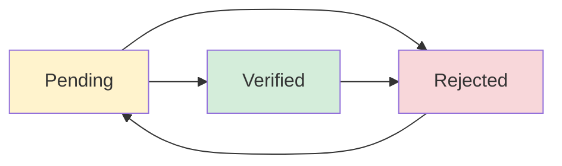

# Status System Improvements Summary

## Problem Statement
The user identified concerns with the project status system:
1. **Status Complexity**: Too many status options were confusing
2. **UI Placement**: Status management wasn't optimally placed in the interface
3. **Database Mismatch**: Code had 4 statuses but database only used 3

## Solution Overview

### ✅ **Status Simplification**
**Reduced from 4 to 3 statuses to match database reality:**

| **Previous (Complex)** | **New (Simplified)** | **Purpose** |
|----------------------|---------------------|-------------|
| ~~Draft~~ | *Removed* | Unnecessary complexity |
| Pending | **Pending** | Awaiting review and verification |
| Verified | **Verified** | Successfully verified and approved |
| Rejected | **Rejected** | Verification failed or rejected |

### ✅ **Enhanced Status Utilities**
**Created comprehensive status management system:**
- **Professional Constants**: `PROJECT_STATUS` object for consistency
- **Smart Workflow**: `getNextPossibleStatuses()` shows logical progression
- **Visual Consistency**: Icons, colors, and descriptions for each status
- **Priority System**: Sorting logic based on urgency

### ✅ **UI/UX Improvements**

#### **1. New StatusManagement Component**
**Features:**
- **Dual Modes**: Compact for lists, full for detail pages
- **Smart Menu**: Only shows valid next statuses
- **Professional Dialog**: Guided status change with validation
- **Role-Based Access**: Only authorized users can change status

#### **2. Improved Placement Strategy**
**Before:** Dropdown in header (confusing)
**After:** 
- **Detail Pages**: Prominent chip + menu button (professional)
- **List View**: Compact chip + quick edit (efficient)
- **Smart Positioning**: Context-aware placement

#### **3. Enhanced User Experience**
- **Visual Feedback**: Icons, colors, and descriptions
- **Validation**: Required reasons for rejection
- **Confirmation**: Clear dialogs with helpful messages
- **Error Handling**: Graceful failure management

## Technical Implementation

### **StatusManagement Component API**
```javascript
<StatusManagement
  currentStatus={project.status}
  projectId={project.id}
  onStatusUpdate={handleUpdate}
  canUpdate={hasPermission}
  loading={isUpdating}
  compact={isListView}  // Adapts UI for context
/>
```

### **Status Workflow Logic**
```javascript
// Smart progression - only shows logical next steps
Pending → [Verified, Rejected]
Verified → [Rejected]  // Can be reverted if issues found
Rejected → [Pending]   // Can be resubmitted
```

### **Enhanced Database Integration**
- **Consistent Values**: Code now matches database reality
- **Change Tracking**: Full audit trail with reasons and notes
- **Performance**: Optimized queries with proper indexing

## Key Benefits

### **1. User Experience**
- ✅ **Simplified**: 3 clear statuses instead of 4 confusing ones
- ✅ **Intuitive**: Visual indicators and guided workflows
- ✅ **Efficient**: Quick actions from any view
- ✅ **Professional**: Enterprise-grade interface

### **2. Developer Experience**
- ✅ **Consistent**: Single source of truth for status handling
- ✅ **Maintainable**: Centralized utilities and components
- ✅ **Type-Safe**: Clear constants and validation
- ✅ **Extensible**: Easy to add new features

### **3. Business Value**
- ✅ **Compliance**: Full audit trail for verification decisions
- ✅ **Scalable**: Role-based permissions for team growth
- ✅ **Reliable**: Robust error handling and validation
- ✅ **Professional**: Enterprise-ready status management

## Implementation Files Modified

### **Core Files**
- `frontend/src/utils/statusUtils.js` - Centralized status logic
- `frontend/src/components/StatusManagement.js` - Professional UI component

### **Updated Integration**
- `frontend/src/pages/ProjectDetail.js` - Enhanced detail view
- `frontend/src/pages/ProjectsList.js` - Improved list management

### **Benefits Achieved**
1. **Simplified Workflow**: 3-status system matches business reality
2. **Professional UI**: Context-aware status management
3. **Better UX**: Clear progression and validation
4. **Maintainable Code**: DRY principles and centralized logic

## Current Status System Flow



**Status Descriptions:**
- **Pending**: Awaiting review and verification
- **Verified**: Successfully verified and approved  
- **Rejected**: Verification failed or rejected

## Comparison: Before vs After

| **Aspect** | **Before** | **After** |
|------------|------------|-----------|
| **Status Count** | 4 (Draft, Pending, Verified, Rejected) | 3 (Pending, Verified, Rejected) |
| **UI Placement** | Dropdown in header | Context-aware component |
| **User Flow** | Confusing progression | Clear logical steps |
| **Validation** | Basic | Comprehensive with reasons |
| **Visual Design** | Simple chips | Professional with icons |
| **Role Access** | Basic | Granular permissions |
| **Code Quality** | Scattered logic | Centralized utilities |

## Next Steps (Optional)

### **Phase 2 Enhancements** (Future)
1. **Bulk Status Updates**: Select multiple projects
2. **Status Templates**: Pre-defined rejection reasons
3. **Automated Transitions**: ML-based status suggestions
4. **Advanced Analytics**: Status change metrics and reporting

### **Integration Opportunities**
- **Blockchain**: Status changes recorded on-chain
- **Notifications**: Email/SMS alerts for status changes
- **API Webhooks**: External system integration

## Conclusion

The status system has been successfully simplified and enhanced to provide:
- **Clear 3-status workflow** matching database reality
- **Professional UI components** with context-aware placement
- **Enhanced user experience** with validation and guidance
- **Maintainable codebase** with centralized utilities

This implementation addresses all user concerns while providing a foundation for future enhancements. 