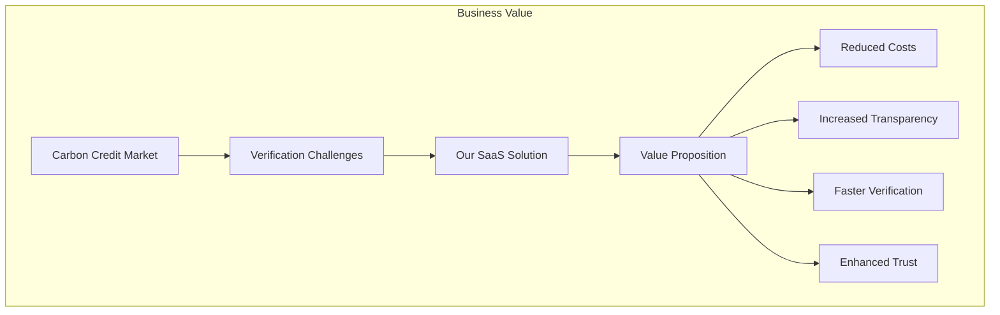

```mermaid
graph TD
    subgraph "Business Value"
        A[Carbon Credit Market] --> B[Verification Challenges]
        B --> C[Our SaaS Solution]
        C --> D[Value Proposition]
        D --> E1[Reduced Costs]
        D --> E2[Increased Transparency]
        D --> E3[Faster Verification]
        D --> E4[Enhanced Trust]
    end
```
