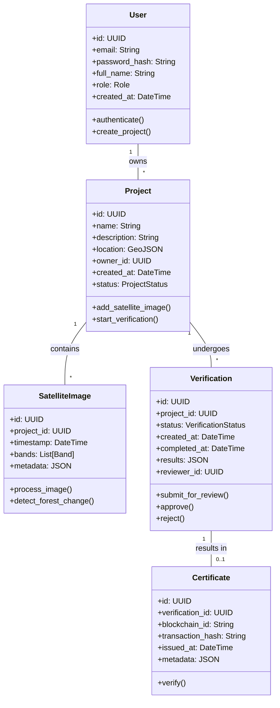

```mermaid
classDiagram
    class User {
        +id: UUID
        +email: String
        +password_hash: String
        +full_name: String
        +role: Role
        +created_at: DateTime
        +authenticate()
        +create_project()
    }
    
    class Project {
        +id: UUID
        +name: String
        +description: String
        +location: GeoJSON
        +owner_id: UUID
        +created_at: DateTime
        +status: ProjectStatus
        +add_satellite_image()
        +start_verification()
    }
    
    class SatelliteImage {
        +id: UUID
        +project_id: UUID
        +timestamp: DateTime
        +bands: List[Band]
        +metadata: JSON
        +process_image()
        +detect_forest_change()
    }
    
    class Verification {
        +id: UUID
        +project_id: UUID
        +status: VerificationStatus
        +created_at: DateTime
        +completed_at: DateTime
        +results: JSON
        +reviewer_id: UUID
        +submit_for_review()
        +approve()
        +reject()
    }
    
    class Certificate {
        +id: UUID
        +verification_id: UUID
        +blockchain_id: String
        +transaction_hash: String
        +issued_at: DateTime
        +metadata: JSON
        +verify()
    }
    
    User "1" -- "*" Project: owns
    Project "1" -- "*" SatelliteImage: contains
    Project "1" -- "*" Verification: undergoes
    Verification "1" -- "0..1" Certificate: results in
```
