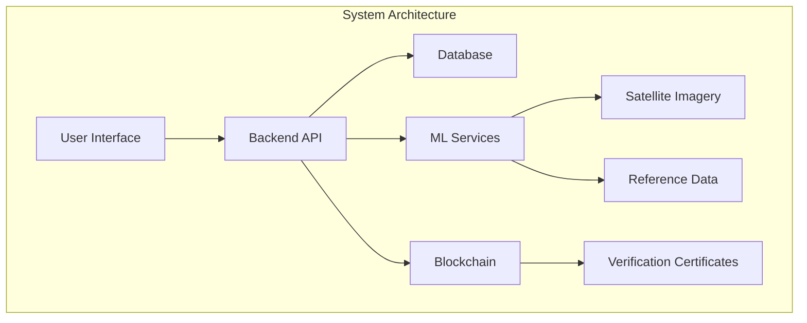

```mermaid
graph TD
    subgraph "System Architecture"
        A[User Interface] --> B[Backend API]
        B --> C1[Database]
        B --> C2[ML Services]
        B --> C3[Blockchain]
        C2 --> D1[Satellite Imagery]
        C2 --> D2[Reference Data]
        C3 --> E[Verification Certificates]
    end
```
