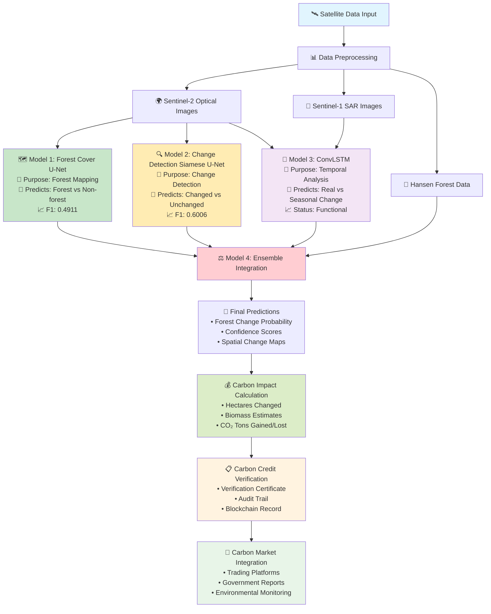
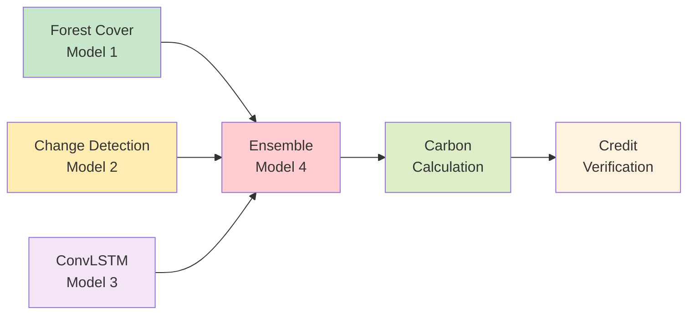
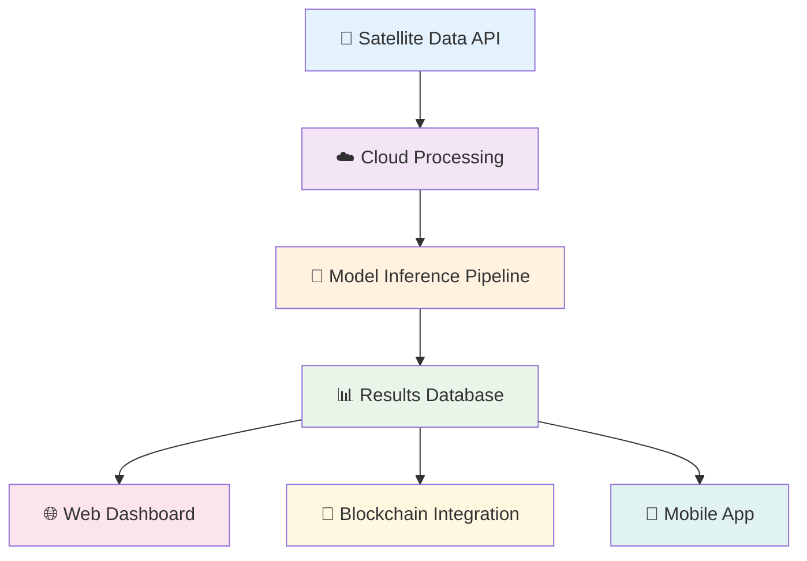

# Carbon Credit Verification Pipeline Architecture

This document contains diagrams explaining the complete pipeline architecture for the 4-model carbon credit verification system.

## 🏗️ **Complete Pipeline Architecture**

```mermaid
graph TD
    A["🛰️ Satellite Data Input"] --> B["📊 Data Preprocessing"]
    B --> C["🌍 Sentinel-2 Optical Images"]
    B --> D["📡 Sentinel-1 SAR Images"] 
    B --> E["🌳 Hansen Forest Data"]
    
    C --> F["🗺️ Model 1: Forest Cover U-Net<br/>📍 Purpose: Forest Mapping<br/>🎯 Predicts: Forest vs Non-forest<br/>📈 F1: 0.4911"]
    
    C --> G["🔍 Model 2: Change Detection Siamese U-Net<br/>📍 Purpose: Change Detection<br/>🎯 Predicts: Changed vs Unchanged<br/>📈 F1: 0.6006"]
    
    C --> H["📅 Model 3: ConvLSTM<br/>📍 Purpose: Temporal Analysis<br/>🎯 Predicts: Real vs Seasonal Change<br/>📈 Status: Functional"]
    D --> H
    
    F --> I["⚖️ Model 4: Ensemble Integration"]
    G --> I
    H --> I
    E --> I
    
    I --> J["🎯 Final Predictions<br/>• Forest Change Probability<br/>• Confidence Scores<br/>• Spatial Change Maps"]
    
    J --> K["💰 Carbon Impact Calculation<br/>• Hectares Changed<br/>• Biomass Estimates<br/>• CO₂ Tons Gained/Lost"]
    
    K --> L["📋 Carbon Credit Verification<br/>• Verification Certificate<br/>• Audit Trail<br/>• Blockchain Record"]
    
    L --> M["🏪 Carbon Market Integration<br/>• Trading Platforms<br/>• Government Reports<br/>• Environmental Monitoring"]
    
    style A fill:#e1f5fe
    style F fill:#c8e6c9
    style G fill:#ffecb3
    style H fill:#f3e5f5
    style I fill:#ffcdd2
    style K fill:#dcedc8
    style L fill:#fff3e0
    style M fill:#e8f5e8
```

## 📋 **Pipeline Stages Explanation**

### **Stage 1: Data Input & Preprocessing** 🛰️
- **Input Sources**: Sentinel-1 SAR, Sentinel-2 Optical, Hansen Forest Data
- **Processing**: Spatial alignment, temporal synchronization, quality control
- **Output**: Clean, aligned multi-source satellite imagery

### **Stage 2: Individual Model Processing** 🤖
Each model processes the data independently:

#### **🗺️ Model 1: Forest Cover U-Net**
- **Input**: 12-channel Sentinel-2 images (64×64 pixels)
- **Process**: Semantic segmentation for forest classification
- **Output**: Binary forest/non-forest predictions
- **Performance**: F1=0.4911 (Balanced forest mapping)

#### **🔍 Model 2: Change Detection Siamese U-Net**
- **Input**: Paired Sentinel-2 images (before/after, 128×128 pixels)
- **Process**: Siamese network compares temporal pairs
- **Output**: Binary change/no-change predictions
- **Performance**: F1=0.6006 (high-recall change detection)

#### **📅 Model 3: ConvLSTM**
- **Input**: 3-step temporal sequences (Sentinel-1 + Sentinel-2)
- **Process**: Temporal pattern analysis with LSTM
- **Output**: Temporal change probability with seasonal context
- **Performance**: Functional (Temporal validation specialist)

### **Stage 3: Ensemble Integration** ⚖️
- **Input**: Predictions from all 3 models + Hansen reference data
- **Process**: Weighted fusion using multiple ensemble methods
- **Output**: Unified predictions with confidence scores
- **Performance**: Expected F1 > 0.6 (Best overall accuracy)

### **Stage 4: Carbon Impact Calculation** 💰
- **Input**: Ensemble predictions + biomass conversion factors
- **Process**: Spatial analysis and carbon accounting
- **Output**: Quantified carbon impact in tons CO₂

### **Stage 5: Verification & Integration** 📋
- **Process**: Generate certificates, audit trails, blockchain records
- **Output**: Verified carbon credits ready for trading

## 🔄 **Model Interaction Flow**

```mermaid
graph LR
    A["Forest Cover<br/>Model 1"] --> D["Ensemble<br/>Model 4"]
    B["Change Detection<br/>Model 2"] --> D
    C["ConvLSTM<br/>Model 3"] --> D
    
    D --> E["Carbon<br/>Calculation"]
    E --> F["Credit<br/>Verification"]
    
    style A fill:#c8e6c9
    style B fill:#ffecb3
    style C fill:#f3e5f5
    style D fill:#ffcdd2
    style E fill:#dcedc8
    style F fill:#fff3e0
```

## 🎯 **Data Flow Details**

### **Input Data Specifications**
| Data Source | Resolution | Bands | Temporal | Usage |
|-------------|------------|-------|----------|-------|
| **Sentinel-2** | 10-20m | 12 spectral | 5-day revisit | Forest mapping, change detection |
| **Sentinel-1** | 10m | 2 polarizations | 6-day revisit | All-weather monitoring |
| **Hansen** | 30m | 4 layers | Annual | Ground truth, validation |

### **Model Processing Specifications**
| Model | Input Size | Processing Time | Memory Usage | Output Format |
|-------|------------|----------------|--------------|---------------|
| **Forest Cover** | 64×64×12 | ~0.1s/patch | 2GB GPU | Binary mask |
| **Change Detection** | 128×128×24 | ~0.2s/pair | 4GB GPU | Change mask |
| **ConvLSTM** | 64×64×12×3 | ~0.3s/sequence | 6GB GPU | Temporal prob |
| **Ensemble** | Combined | ~0.1s/fusion | 1GB GPU | Final prediction |

## 🚀 **Production Deployment Flow**

```mermaid
graph TD
    A["📡 Satellite Data API"] --> B["☁️ Cloud Processing"]
    B --> C["🤖 Model Inference Pipeline"]
    C --> D["📊 Results Database"]
    D --> E["🌐 Web Dashboard"]
    D --> F["🔗 Blockchain Integration"]
    D --> G["📱 Mobile App"]
    
    style A fill:#e3f2fd
    style B fill:#f3e5f5
    style C fill:#fff3e0
    style D fill:#e8f5e8
    style E fill:#fce4ec
    style F fill:#fff8e1
    style G fill:#e0f2f1
```

## 📈 **Performance Monitoring**

### **Target Metrics (design goals, not benchmarked)**
- **Throughput**: 1000+ hectares processed per minute
- **Carbon calculation**: deterministic area-based CO₂ estimate (no validated accuracy figure)
- **Latency**: <30 seconds end-to-end processing
- **Availability**: no uptime SLA — prototype

### **Quality Assurance**
- **Cross-validation** between models
- **Confidence scoring** for all predictions
- **Anomaly detection** for unusual patterns
- **Human-in-the-loop** verification for high-value credits

## 🔧 **Technical Implementation**

### **Infrastructure Requirements**
- **GPU**: NVIDIA V100/A100 for model inference
- **Storage**: 10TB+ for satellite imagery archive
- **Network**: High-bandwidth for satellite data download
- **Compute**: Kubernetes cluster for scalable processing

### **Software Stack**
- **ML Framework**: PyTorch for model training/inference
- **Data Processing**: GDAL, Rasterio for geospatial data
- **Orchestration**: Apache Airflow for pipeline management
- **API**: FastAPI for web service endpoints
- **Database**: PostgreSQL + PostGIS for spatial data

## 🎯 **Success Metrics**

| Metric | Target | Current Status |
|--------|--------|----------------|
| **Model Accuracy** | F1 > 0.6 | Forest-cover F1 = 0.49, change-detection F1 = 0.60; ensemble not yet benchmarked |
| **Processing Speed** | <1 min/1000 ha | Not benchmarked |
| **Carbon Precision** | >99% accuracy | No validated accuracy figure (deterministic area-based estimate) |
| **System Uptime** | >99.5% | Not measured (not deployed) |

---

**Result**: An automated pipeline that transforms satellite images into carbon-credit estimates. 🛰️ → 🌳 → 💰 